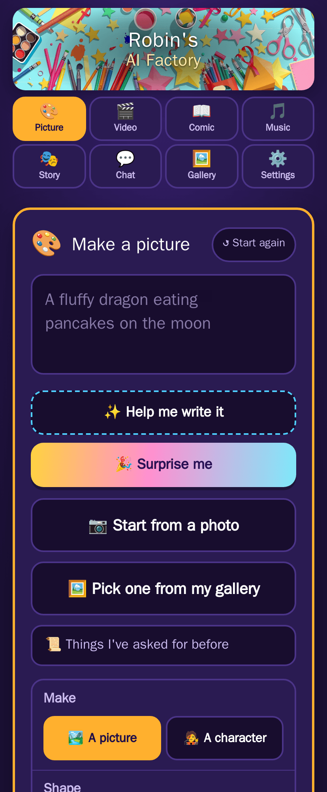

# Makery

A front-end for ComfyUI built for a child, not for an operator. No model
pickers, no samplers, no seeds: a box to type in, a big button, and a gallery
of everything they have made. It runs beside a ComfyUI and an Ollama you
already have and talks to them over the network. It renders nothing itself.

It was written for a child with an iPad, which explains most of the design:
tabs instead of a long page, one job at a time, seven languages, and a
grown-up page at a separate URL behind a PIN. Self-hosted, Apache 2.0, and
meant for a home network. There is no login on the child's side, so read
[Before a child uses it](#before-a-child-uses-it) before deciding whether that
is the right shape for your house.

## What it looks like

**Making something.** One box to type in, one button, and dropdowns that turn
a few words into a good prompt. Every card says how long it will take on
*this* machine, from what the last few actually took.


**Everything they have made** is one page, newest first or a shelf per kind,
with search, tags, favourites, a zip of the lot and a trash that keeps things
for a week.


**The parent page** is `/parent`, behind a PIN: today at a glance, who uses
it, the rules and daily limits, alerts, their stuff, a sealed activity log, the
settings, and every instruction this app gives a model.


**Built for a tablet, works on a phone.** Same page, same code.



## What you need

- **ComfyUI 0.36 or newer**, with the model files listed in
  [step 1](#1-put-the-models-where-comfyui-can-find-them). Makery was verified
  against 0.36.0; older versions may not have the Flux 2 and LTX 2.5 nodes.
- **Ollama**, with one vision model pulled
  ([step 2](#2-pull-the-ollama-models)). Both are easiest in Docker on one
  shared network, which is what the steps below assume.
- **An NVIDIA GPU with 16 GB of VRAM or more.** 16 GB is what this was built
  and measured on, and it is close to the floor: a 15-second video peaks near
  15.5 GB, and the picture-editing graphs at 15.8 GB.
- **About 100 GB of disk for models**: 81 GB for ComfyUI, 11 GB for Ollama,
  and another 20 GB if you want the Music tab.
- **Docker and Docker Compose.**

Starting with a machine that has none of that? Do
[Starting from a bare machine](#starting-from-a-bare-machine) first, then come
back here.

## Install

Six steps. The first one is the one that takes an afternoon, because it is
mostly downloading.

### 1. Put the models where ComfyUI can find them

The graphs load these **by name**, so a file with the right weights and a
different filename is a failed render, not a warning. All paths are under
ComfyUI's `models/` directory.

**Pictures and video** (required, about 62 GB):

| File | Directory | Size |
|---|---|---|
| `flux1-schnell-fp8.safetensors` | `checkpoints/` | 17.2 GB |
| `ltx-2.5-22b-distilled-transformer-comfy-int8-convrot.safetensors` | `diffusion_models/` | 21.5 GB |
| `gemma4-12b-with-proj-ltx-2.5-comfy-int8-convrot.safetensors` | `text_encoders/` | 15.4 GB |
| `gemma4_e2b_it_int8_convrot.safetensors` | `text_encoders/` | 5.2 GB |
| `ltx-2.5-video-vae-bf16.safetensors` | `vae/` | 1.5 GB |
| `ltx-2.5-audio-vae-bf16.safetensors` | `vae/` | 0.4 GB |
| `ltx-2.5-latent-spatial-upscaler-x2-bf16-1.0.safetensors` | `latent_upscale_models/` | 1.0 GB |

**Changing a picture** ("Turn it into…", "Change this picture", "What's
outside the frame?", "Fix just this bit"; about 18 GB):

| File | Directory | Size |
|---|---|---|
| `flux-2-klein-9b-fp8.safetensors` | `diffusion_models/` | 9.4 GB |
| `qwen_3_8b_fp8mixed.safetensors` | `text_encoders/` | 8.7 GB |
| `flux2-vae.safetensors` | `vae/` | 0.3 GB |

**"Make it huge" and "Make it smooth"** (small):

| File | Directory | Size |
|---|---|---|
| `4x-UltraSharp.pth` | `upscale_models/` | 67 MB |
| `rife49.pth` | `custom_nodes/comfyui-frame-interpolation/ckpts/rife/` | 21 MB |

**Music** (optional, about 20 GB; without these the Music tab hides itself):

| File | Directory | Size |
|---|---|---|
| `acestep_v1.5_xl_turbo_bf16.safetensors` | `diffusion_models/` | 10.0 GB |
| `qwen_4b_ace15.safetensors` | `text_encoders/` | 8.4 GB |
| `qwen_0.6b_ace15.safetensors` | `text_encoders/` | 1.2 GB |
| `ace_1.5_vae.safetensors` | `vae/` | 0.3 GB |

The easiest way to get exactly these files is ComfyUI itself. Open its
Templates browser, load the **Flux schnell**, **LTX 2.5**, **Flux 2 Klein
image edit (9B, distilled)** and **ACE-Step 1.5** templates, and accept the
downloads it offers. They land in the right directories under the right names.

**One custom node pack** is needed, for "Make it smooth" and "Slow it down"
only:
[ComfyUI-Frame-Interpolation](https://github.com/Fannovel16/ComfyUI-Frame-Interpolation).
Install it through ComfyUI Manager or by cloning it into `custom_nodes/`.
Without it those two buttons fail and nothing else notices. Every other node
ships with ComfyUI.

Makery checks this at startup and writes one log line naming every file it
wants and ComfyUI cannot see. It does not refuse to start, so read the log
after the first start rather than finding out by tapping Go.

### 2. Pull the Ollama models

```bash
docker exec ollama ollama pull qwen3-vl:4b-instruct   # 3.3 GB, required
docker exec ollama ollama pull gemma4:12b             # 7.6 GB, optional: the Chat tab
```

The first one is the idea helper: "help me write it", translation, planning
comics and films, and screening uploaded photos. It **must be a vision model**,
because three of those jobs send it a picture. The second one runs the Chat
tab and answers questions on Telegram; without it the Chat tab hides itself.

Makery never downloads a model. Which model does which job is chosen on the
parent page from whatever Ollama already has.

### 3. Make the gallery folder

Makery reads ComfyUI's output directory **directly** as the gallery. Nothing is
copied. It also needs to **delete** from that folder, and ComfyUI owns it, so
the folder must exist before the first start, be group-writable, and carry
the setgid bit.

Replace `999:987` below with the uid and gid ComfyUI runs as (see
[File ownership](#file-ownership) if you are not sure):

```bash
mkdir -p /path/to/comfyui/basedir/output/makery
sudo chown 999:987 /path/to/comfyui/basedir/output/makery
sudo chmod 2775 /path/to/comfyui/basedir/output/makery
```

You do not need to change anything inside ComfyUI. Makery sets the output
prefix on every graph it submits, so everything it makes lands in that
`makery/` subfolder.

### 4. Configure

```bash
git clone https://github.com/mzac/Makery.git && cd Makery
cp .env.example .env
```

Open `.env` and set these. Everything else has a working default.

```ini
# Where ComfyUI writes. The folder you made in step 3.
GALLERY_DIR=/path/to/comfyui/basedir/output/makery

# ComfyUI's input directory, so leftover frames can be swept.
COMFY_INPUT_DIR_HOST=/path/to/comfyui/basedir/input

# The Docker network ComfyUI and Ollama are on. `docker network ls`.
NETWORK_NAME=ai-stack_aistack

# Container names on that network, or host:port.
COMFY_URL=http://comfyui:8188
OLLAMA_URL=http://ollama:11434

# A uid, and ComfyUI's gid, so the container may delete from GALLERY_DIR.
RUN_AS=1000:987

# Change this. The default is 1234 and it is public knowledge.
PARENT_PIN=

# Your timezone, so "today" resets at your midnight.
TZ=Europe/London
```

If ComfyUI and Ollama are **not** in Docker, set `NETWORK_NAME=bridge` and
use the host's IP address in the two URLs, for example
`COMFY_URL=http://192.168.1.10:8188`.

`.env.example` documents every other variable. Most of them are read once, on
the first start, and then owned by the parent page. See
[Where settings live](#where-settings-live).

### 5. Start it

```bash
docker compose up -d --build
docker compose logs makery | grep -iE "model|warn"
```

The second line shows the startup check. Nothing about models means every file
was found.

**Prefer a prebuilt image?** Every push to `main` and every release is
published to GitHub Container Registry. In `docker-compose.yml`, replace
`build: .` with:

```yaml
    image: ghcr.io/mzac/makery:latest     # or a release, e.g. :1.0.0
```

Then `docker compose pull && docker compose up -d` instead of `--build`.

### 6. First visit

- The child's page is `http://<host>:8095`.
- The parent page is `http://<host>:8095/parent`. Sign in with the PIN and
  change it under **Settings → The PIN on this page** if you did not set one in
  `.env`.
- Add a name and age under **Who uses it**, or set `KID_NAME` and `KID_AGE` in
  `.env` before the first start.

To reach it by a hostname, or over HTTPS (needed for the camera and the
voice-over), see [Reaching it by name](#reaching-it-by-name).

## Starting from a bare machine

Skip this if ComfyUI and Ollama are already running.

### Docker with GPU access

Install Docker, then the NVIDIA Container Toolkit so containers can see the
card:

```bash
# Debian / Ubuntu
curl -fsSL https://nvidia.github.io/libnvidia-container/gpgkey \
  | sudo gpg --dearmor -o /usr/share/keyrings/nvidia-container-toolkit-keyring.gpg
curl -s -L https://nvidia.github.io/libnvidia-container/stable/deb/nvidia-container-toolkit.list \
  | sed 's#deb https://#deb [signed-by=/usr/share/keyrings/nvidia-container-toolkit-keyring.gpg] https://#g' \
  | sudo tee /etc/apt/sources.list.d/nvidia-container-toolkit.list
sudo apt update && sudo apt install -y nvidia-container-toolkit
sudo nvidia-ctk runtime configure --runtime=docker && sudo systemctl restart docker
docker run --rm --gpus all nvidia/cuda:12.4.0-base-ubuntu22.04 nvidia-smi   # must print your card
```

### ComfyUI and Ollama

Makery joins an existing network rather than owning ComfyUI and Ollama, so
they get a compose file of their own. Put this in a directory of its own, for
example `~/ai-stack/compose.yaml`:

```yaml
services:
  comfyui:
    image: mmartial/comfyui-nvidia-docker:ubuntu26_cuda13.3-latest
    container_name: comfyui
    restart: unless-stopped
    gpus: all
    ports:
      - "8188:8188"
    environment:
      # The uid/gid that will own everything under ./comfyui on the host.
      # Make a user for it (`sudo useradd -r comfyui`, then `id comfyui`).
      WANTED_UID: 999
      WANTED_GID: 987
      BASE_DIRECTORY: /basedir
      USE_UV: "true"
      NVIDIA_VISIBLE_DEVICES: all
      NVIDIA_DRIVER_CAPABILITIES: all
    volumes:
      - ./comfyui/run:/comfy/mnt          # ComfyUI itself and its venv
      - ./comfyui/basedir:/basedir        # models, input, output, custom nodes
    networks: [aistack]

  ollama:
    image: ollama/ollama:latest
    container_name: ollama
    restart: unless-stopped
    gpus: all
    ports:
      - "11434:11434"
    environment:
      OLLAMA_KEEP_ALIVE: "10m"
    volumes:
      - ollama:/root/.ollama
    networks: [aistack]

networks:
  aistack:
    driver: bridge

volumes:
  ollama: {}
```

```bash
cd ~/ai-stack
docker compose up -d
docker compose logs -f comfyui        # the first start installs ComfyUI; several minutes
docker network ls | grep aistack      # prints "ai-stack_aistack": that is NETWORK_NAME
```

Once ComfyUI answers on port 8188, go back to [Install](#install). The paths
for step 3 and step 4 are then `~/ai-stack/comfyui/basedir/output/makery` and
`~/ai-stack/comfyui/basedir/input`.

## Reaching it by name

Optional. If you want `make.example.net` instead of a port, this nginx vhost
handles the two things that matter: WebSockets, and a long read timeout,
because a render holds the connection for minutes.

```nginx
map $http_upgrade $connection_upgrade { default upgrade; '' close; }

server {
    listen 443 ssl;
    http2  on;
    server_name make.example.net;

    ssl_certificate     /etc/letsencrypt/live/example/fullchain.pem;
    ssl_certificate_key /etc/letsencrypt/live/example/privkey.pem;

    client_max_body_size 0;          # photos come straight off an iPad

    location / {
        # Resolved per request against Docker's DNS, so nginx still starts
        # when the app is down.
        resolver 127.0.0.11 valid=30s;
        set $upstream http://makery:8000;
        proxy_pass $upstream$request_uri;

        proxy_set_header Host $host;
        proxy_set_header X-Real-IP $remote_addr;
        proxy_set_header X-Forwarded-For $proxy_add_x_forwarded_for;
        proxy_set_header X-Forwarded-Proto $scheme;

        proxy_http_version 1.1;
        proxy_set_header Upgrade $http_upgrade;
        proxy_set_header Connection $connection_upgrade;

        proxy_buffering off;         # progress must arrive as it happens
        proxy_read_timeout 7d;
        proxy_send_timeout 7d;
    }
}
```

Run nginx on the same Docker network so `makery:8000` resolves.

**Use HTTPS if you can.** Safari only allows the camera and the microphone on
a secure page. Over plain HTTP the "take a photo" and voice-over buttons are
still there and explain why they cannot work.

## Running without Docker

```bash
pip install -r requirements.txt        # Python 3.12
GALLERY_DIR=/path/to/comfyui/output/makery \
STATE_DIR=/path/to/makery-state \
COMFY_URL=http://127.0.0.1:8188 \
OLLAMA_URL=http://127.0.0.1:11434 \
uvicorn app.main:app --port 8000
```

`STATE_DIR` is where settings and backups go. Leave it out and they go into
`GALLERY_DIR` beside the pictures, which works but is untidy.

## Updating

```bash
git pull
./safe-rebuild
```

If you use the prebuilt image, `docker compose pull && docker compose up -d`
does the same job.

`docker compose up -d --build` also works, but rebuilding mid-render loses
the progress bar and the notes for the file being made. `safe-rebuild` waits
for ComfyUI's queue to empty first, then rebuilds and recovers any notes that
were lost.

## Troubleshooting

**The gallery is empty, but ComfyUI made the file.** `GALLERY_DIR` is not the
folder ComfyUI writes to. Makery writes under `<ComfyUI output>/makery/`, and
`GALLERY_DIR` has to point at exactly that folder.

**Everything works except deleting.** The container cannot write to the gallery
directory. Check step 3: the folder must be group-writable with the setgid bit,
and `RUN_AS` must end in that group's gid. See [File ownership](#file-ownership).

**The log says a model is missing.** Compare the filename in the log with the
tables in step 1, character for character. The graphs load models by name.

**The Music or Chat tab is not there.** Music hides itself when its four model
files are missing. Chat hides itself when `gemma4:12b` (or whichever model is
chosen on the parent page) is not pulled in Ollama.

**The idea helper is slow.** Ollama has fallen back to the CPU because the GPU
was full. The parent page's "Right now" tab shows tokens per second; under 25
means CPU. Makery asks ComfyUI to free its VRAM before every helper call, but
another process using the card will still cause this.

**No GPU figures on the parent page.** The `gpus: all` line in
`docker-compose.yml` is missing or the NVIDIA Container Toolkit is not
installed. Everything else works without it.

**"Take a photo" or the voice-over says it cannot work.** You are on plain
HTTP. Safari needs HTTPS for the camera and microphone. See
[Reaching it by name](#reaching-it-by-name).

**Forgotten the PIN.** A PIN set on the parent page lives in the database and
overrides `.env`. Remove it from a shell on the host, and the `.env` value (or
the default `1234`) applies again:

```bash
docker compose exec makery python -c "from app import gallery, config; config.clear('parent_pin')"
```

There is deliberately no way to do this from the page.

**Upgrading from when this was called easy-iv-gen.** The default state volume
was renamed. If `STATE_VOLUME` is empty in your `.env`, copy the old volume
across before the first start or you will get empty settings:

```bash
docker run --rm -v <project>_easy-iv-gen-state:/old -v <project>_makery-state:/new \
  alpine sh -c 'cp -a /old/. /new/'
```

Also re-mount the host output directory at `/basedir/output/makery` and point
`GALLERY_DIR` at it, because the output prefix changed from `easy-iv-gen/` to
`makery/`.

### File ownership

The container has to **delete** from `GALLERY_DIR`, which ComfyUI owns.
Unlinking a file needs write permission on the *directory*, so the arrangement
is: the directory owned by ComfyUI's user and group, group-writable and setgid
(`chmod 2775`), and `RUN_AS` set to any uid plus ComfyUI's gid, for example
`RUN_AS=1000:987`. Files ComfyUI writes are `644`, which is fine: Makery only
reads and unlinks them.

If you point `STATE_VOLUME` at a host path instead of the default named
volume, create it and `chown` it to `RUN_AS` before the first start. Docker
creates a missing bind-mount source as `root:root`, the container cannot write
to it, and the app then quietly saves nothing.

## What it can make

Each maker is a tab, and a parent can switch any of them off.

- **Pictures** from a sentence, one at a time or four to choose between, in
  landscape, portrait or square. "A character" draws the idea alone on a plain
  background so it can be cut out as a sticker.
- **Videos** with sound, 5 to 15 seconds: from words, from a picture, between
  two pictures, or a **little film** of two to four clips where each starts
  from the last frame of the one before.
- **Songs**, 10 seconds to two minutes, with or without singing, plus short
  instrumental tunes and long background hums. One button writes the
  description and the lyrics from a single idea.
- **Comics**: a story becomes a 3, 4 or 6 panel strip with speech bubbles.
- **Chat** with a local model. Every reply is filtered in full before it is
  shown, and every turn is logged where a parent can read it.
- **A Story**: one idea walked through picture, film and song, each shown
  before the next step starts, and put together at the end.

**Changing a picture they already have**: turn it into a cartoon, a painting,
a clay model or stained glass; change one thing ("give the fox a scarf");
extend it outside the frame; or paint over a bit and say what should be there.
All four use the child's own picture as the reference, so it is the same
picture changed rather than a new one.

**Then do things to them**: favourite, name and tag; cut out a sticker; make
it four times bigger; smooth a video or slow it down; keep two seconds as a
looping sticker; grab a frame; record a voice-over; drop in a sound effect;
join clips into a movie with a title card; draw on it; print it; compare two
with a wipe slider. Deleted things go to a trash for a week.

**Help with the words**: "Help me write it" expands a few words into a full
prompt, and given a picture, looks at it and writes a prompt for animating
what is there. "Surprise me" invents an idea. Saved **characters** can be put
into later pictures, with the honest caveat that this gives a family
resemblance rather than the same character twice.

**Seven languages**: English, French, German, Spanish, Italian, Dutch and
Portuguese, switched by the child in their own Settings tab. The whole page
and the helpers follow. What reaches the image model is translated to English,
because that is what it understands; lyrics are never translated.

**Profiles**: several children on one installation, each with their own
gallery, limits, rules and timetable. With one profile there is no sign-in
screen at all. A **Family** shelf lets a child share one thing with every
profile.

## The parent page

`/parent`, behind the PIN. Eight tabs:

| Tab | What is on it |
|---|---|
| **Right now** | Is it working, today's counts and thumbnails, live GPU and VRAM figures, the pause switch |
| **Who uses it** | Add, rename and remove profiles; the everybody-sees-everybody switch |
| **Rules** | Daily limits with a one-tap top-up that expires at midnight; the weekly timetable; the warm-up sums; which makers exist; what happens after a refusal |
| **Alerts** | The nightly email, messages to a phone, the Telegram bot |
| **Their stuff** | The chat transcript, the trash, refused uploads with an Allow button, save-it-all zips |
| **Log** | Everything the app has done, each entry sealed against the one before; downloadable as CSV or JSONL |
| **Settings** | Backup and restore, the PIN, what it talks to, which Ollama model does which job, how files are named, how long things can be, wording, tidying up |
| **What it tells the AI** | Every instruction this app gives a model, readable and, with a switch, editable |

**Three things can stand between a tap and a render**, all enforced on the
server: warm-up sums (off by default), daily limits per profile (the trash
counts, so deleting does not refund), and the pause switch or the weekly
timetable. A render already running is always left to finish.

**Alerts** go through [Apprise](https://github.com/caronc/apprise), so one URL
per service covers Telegram, WhatsApp, Signal, ntfy, Discord, Matrix and about
150 more. Each picture as it is made, running out for the day, the daily
summary, a wrong PIN, and anything the filter stopped can each be switched on
or off. A nightly email with thumbnails is separate and optional.

**The Telegram bot can answer back** if you turn it on: `/today`, `/more 5`,
`/more 5 videos`, `/last`, `/pause`, `/open`, `/hours`, `/lock`, `/unlock`,
`/help`, or a question in plain words answered from today's numbers. Only the
chat IDs you list may use it; anyone else is ignored without a reply.

## Before a child uses it

Four things worth knowing, none of them reassuring.

**There is no authentication on the child's side.** Anything that can reach
the port can make a picture, browse the gallery and delete from it. It is meant
to live on a home network behind a router. Nothing about it is safe to put on
the internet.

**The parent PIN has a published default of `1234`.** The app warns on every
start until it is changed. Change it before a child works out that 1234 is
the first thing anyone tries. Five wrong guesses lock the box for ten minutes
and can send you a message. There is no way to switch the PIN off.

**The content filter is an input-side blocklist and nothing else.** It reads
the words typed, in all seven languages, and refuses a match before anything
reaches ComfyUI. It covers sexual content, sexualised minors, violence,
weapons, drugs, hate, real named people and scary imagery. It does **not** look
at what comes back. The negative prompts in every workflow are inert, because
every graph runs at CFG 1.0 where they are mathematically ignored. Uploaded
photos are also shown to the vision model, which fails *open* if Ollama is
unreachable. A model can still draw something nobody asked for, and nothing in
this app will catch it. There is no setting that turns the blocklist off.

**Profiles are a curtain, not a lock.** Two children get separate galleries,
limits and rules, not separate accounts. Switching profile is one tap with no
PIN, and a direct media URL still opens for anyone who has it. That was chosen
on purpose for a shared iPad.

A refusal can optionally close the whole app until a parent reopens it, with
the grown-ups told immediately either way. That is off by default and set
under **Rules → If the filter says no**.

## Where settings live

`.env` holds three different kinds of variable, and `.env.example` is laid out
in the same three parts with a comment on every line.

**Seven that only `.env` can set.** Compose reads them to build the container:
`GALLERY_DIR`, `STATE_VOLUME`, `COMFY_INPUT_DIR_HOST`, `RUN_AS`, `HOST_PORT`,
`CONTAINER_NAME`, `NETWORK_NAME`. Change one and rebuild.

**Nine that `.env` and the parent page share.** A value set on the page wins,
`.env` is the fallback, and clearing the box on the page puts `.env` back.
Nothing is copied between them.

| Variable | On the page | Takes effect |
|---|---|---|
| `COMFY_URL` | Settings → What it talks to | **restart** |
| `OLLAMA_URL` | Settings → What it talks to | live |
| `LOG_LEVEL` | Settings → What it talks to | live |
| `TZ` | Settings → What it talks to | **restart** |
| `PARENT_PIN` | Settings → The PIN on this page | live |
| `DIGEST_SMTP_PASS` | Alerts → Daily email | live |
| `DIGEST_URL` | Alerts → Daily email | live |
| `NOTIFY_URLS` | Alerts → Messages to your phone | live |
| `TELEGRAM_BOT_TOKEN` | Alerts → Asking the bot things | live |

The five credentials among them (the PIN, the relay password, the Apprise
URL, the notify URLs and the bot token) are never shown back on the page,
never written to the log, and never included in a backup.

**Everything else is a first-run default.** Each of the remaining variables is
read **once**, on the first start against an empty database, to fill in a
setting. After that the parent page owns it and `.env` is never consulted for
it again. Editing one later and rebuilding does nothing. They cover which
makers exist, the timetable, the sums, the daily limits, how long videos and
songs may be, the trash, the log, the email, the phone messages, the bot,
wording, which Ollama model does which job, and how files are named.
`.env.example` says where each one is on the parent page.

Settings live in one SQLite file, `state.db`, in the `/state` volume, together
with the profiles, characters, chat transcript and backups. Nothing the app
*decides* is written into `GALLERY_DIR`.

### Backups

**Settings → Backup and restore** on the parent page downloads one JSON file
with every setting, profile, face, character and the activity log in it. A
few hundred kilobytes; mail it to yourself. It is **not** the gallery, which is
already files on a disk you can copy. One is also written every night into
`/state/backups`, keeping the newest seven. Restoring is a two-tap that takes
a safety copy first and never renumbers a child.

### The log

The **Log** tab lists everything the app has done, each entry sealed against
the one before it. *Check the chain* says "intact" or names the entry where it
breaks. Nothing in the app deletes or shortens it. Kept for ever by default.

## For developers

**The API** is one FastAPI app under `/api`, JSON in and out, with no
authentication except `X-Parent-Pin` on `/api/parent/*`. Every
`/api/generate/*` route runs the blocklist first. It exists to serve the two
pages in `static/` and is not a versioned public API. The full contract is in
[`CLAUDE.md`](CLAUDE.md) under "Backend contract".

**The workflows** in `workflows/` are ComfyUI API-format exports, treated as
data: prompts, seeds, sizes, durations and output prefixes are patched at
runtime by `app/workflows.py` against node IDs documented in `CLAUDE.md`. Do
not hand-edit them. Six are exceptions built by hand from `GET /object_info`
because no shipped template does those jobs; each carries a `_note` saying so.

**Releases and the image** are GitHub Actions in `.github/workflows/`. Every
push to `main` builds and pushes `ghcr.io/mzac/makery:latest`; pushing a tag
builds the versioned image and creates a GitHub Release with generated notes:

```bash
git tag v1.0.0 && git push origin v1.0.0
```

A tag with a hyphen in it (`v1.1.0-rc1`) is marked as a pre-release.

**Layout:**

```
app/         FastAPI backend: routes, jobs, the ComfyUI client, the gallery,
             safety, settings, profiles, the helpers, alerts, the bot
static/      the child's page and the parent page (index.html, app.js,
             parent.html, parent.js, i18n.js, style.css)
workflows/   ComfyUI graphs in API format
docs/        the screenshots above
```

[`CLAUDE.md`](CLAUDE.md) is the long version: the node maps, the resolution
arithmetic, the measurements behind every limit, and the reasoning behind the
decisions that look odd.

## Licence

Apache License 2.0. See [LICENSE](LICENSE) and [NOTICE](NOTICE).

The models the workflows load have licences of their own: check Flux
schnell's, Flux 2 Klein's, LTX 2.5's and ACE-Step's terms before using
anything this produces commercially.
